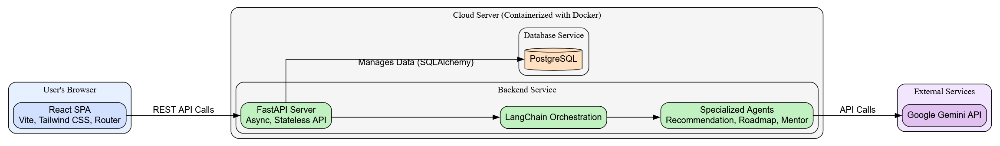
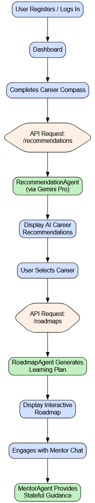

# Project Satori: AI Career Advisor

*Guiding India's Future, One Career at a Time*

## Team Details

- **Team Name**: Satori
- **Team Leader**: Omm Satyakam

---

## The Challenge: Navigating the Career Maze

For millions of students across India, choosing a career path feels like standing at a daunting crossroads with a thousand branching paths and no map. They are inundated with generic advice but starved for guidance that speaks to their unique skills and dreams. This leads to decision paralysis, missed opportunities, and a generation of talent struggling to find their place.

Students need more than just a list of jobs; they need a trusted co-pilot for their career journey.

---

## Our Solution: Meet Satori 💡

**Project Satori** is an intelligent, full-stack career advisor built to replace confusion with clarity. We provide a seamless, end-to-end platform that empowers students to discover, plan, and pursue their ideal careers with confidence.

Through an intuitive journey, a user is transformed from uncertain to empowered:

1. **Discover Your Path**: Our **Career Compass** assessment goes beyond surface-level questions to understand the user's core identity.
2. **See Your Future**: The AI, powered by **LangChain + Gemini Pro**, generates **personalized career recommendations** that align with their profile.
3. **Build Your Dream**: Satori then crafts a **detailed, week-by-week learning roadmap**, turning an abstract goal into an achievable plan.
4. **Never Walk Alone**: Throughout their journey, our **conversational AI Mentor** is available 24/7 to answer questions, offer encouragement, and provide context-aware guidance.

---

## What Makes Satori Unique? 🚀

We don't just provide information; we provide a complete, integrated guidance ecosystem.

- **From Confusion to Clarity: A True End-to-End Platform**
    While other resources are fragmented—a personality test here, a job board there—Satori unifies the entire process. From initial self-discovery to a detailed action plan and ongoing mentorship, everything a student needs is in one place.

- **Beyond Reports: A Mentor That Listens and Remembers**
    Our stateful AI Mentor is our crown jewel. It remembers past conversations, understands the user's context, and provides continuous, interactive support. It’s the difference between a static brochure and a living, breathing guide.

- **Intelligence with Purpose: Specialized AI Agents**
    Our backend uses distinct AI agents for recommendations, roadmaps, and mentorship. This specialized approach ensures the highest quality output, delivering nuanced, accurate, and truly helpful guidance at every step.

---

## Core Features

- 🔐 **Secure JWT Authentication**: For a safe and personalized user experience.
- 🧭 **Career Compass Questionnaire**: An interactive deep dive into a user's potential.
- 🧠 **AI-Powered Recommendations**: Not just jobs, but tailored career callings.
- 🗺️ **AI-Generated Learning Roadmaps**: A step-by-step, actionable blueprint for success.
- 💬 **Stateful Mentor Chat**: An always-on AI companion for continuous guidance.
- ✨ **Modern UI/UX**: A beautiful, responsive interface built with React, Tailwind, and subtle animations.
- ⚙️ **Unified API Schema**: A robust and predictable backend for seamless communication.

---

## The Satori Journey: A User's Path to Purpose

1. 👋 **Join & Sign In**: A quick and secure authentication process.
2. 🧭 **Find Your North**: Complete the insightful Career Compass questionnaire.
3. 💡 **The "Aha!" Moment**: Receive AI-generated career recommendations that resonate.
4. 🗺️ **Chart the Course**: Select a career and get a detailed, week-by-week action plan.
5. 🤝 **Walk the Path**: Engage with the AI Mentor for continuous support and advice.

*Figure: The Satori user journey, from sign-up to ongoing mentorship.*

---

## Our Architecture: Built for Scale and Performance 🛠️

Our system is designed from the ground up to be robust, scalable, and maintainable.

- **Frontend**: A snappy and modern **React** SPA (built with Vite) for a fluid user experience.
- **Backend**: A high-performance, asynchronous **FastAPI** application, ready to handle thousands of concurrent users.
- **AI Layer**: An intelligent core orchestrated by **LangChain**, leveraging the power of **Google's Gemini Pro** through specialized agents.
- **Database**: A reliable **PostgreSQL** database for all persistent data.
- **DevOps**: The entire application is containerized with **Docker & Docker Compose**, ensuring consistency from development to production.

*Figure: Our Architecture Diagram.*

---

## The Tech Stack

- **Frontend**: React, Vite, Tailwind CSS, react-router-dom
- **Backend**: Python, FastAPI
- **AI**: LangChain, Google Gemini Pro (`gemini-1.5-pro-latest`)
- **Database**: PostgreSQL, SQLAlchemy 2.0 (async)
- **DevOps**: Docker, Docker Compose, Poetry

---

## Business Viability: Lean, Scalable, and Cost-Effective 💰

Our architecture is not just powerful—it's incredibly efficient.

- **Lean Infrastructure**: The entire MVP runs seamlessly in a containerized environment on a single, low-cost VM.
- **Elastic Costs**: Our primary operational expense is the **Gemini API**, which is a pay-as-you-go service. This means our costs scale directly with user engagement, making the business model highly sustainable and investor-friendly.
- **MVP Ready**: With development complete, we have a market-ready product with minimal initial overhead.
